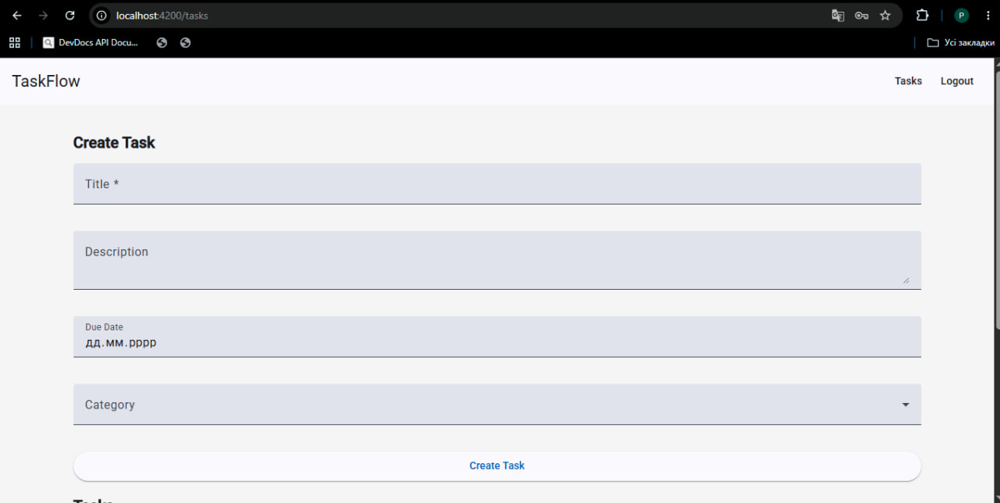
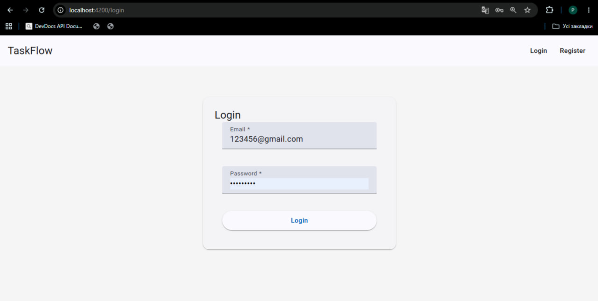
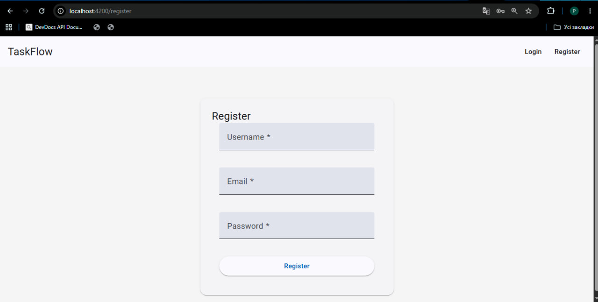
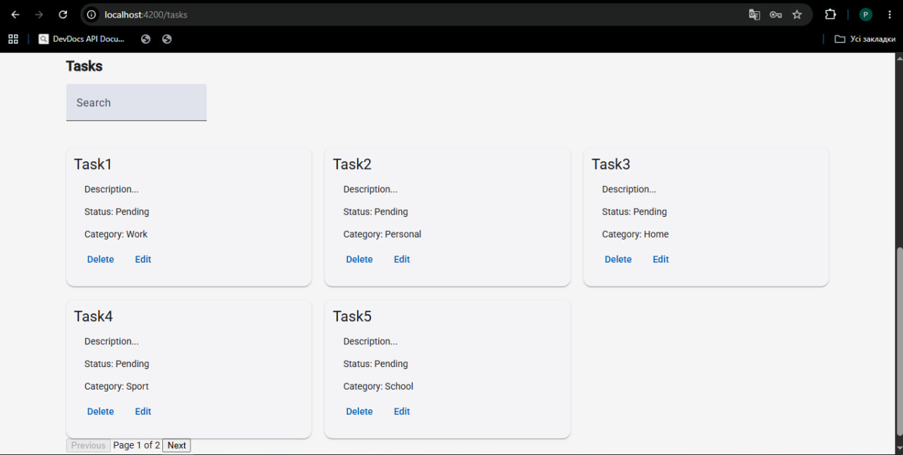
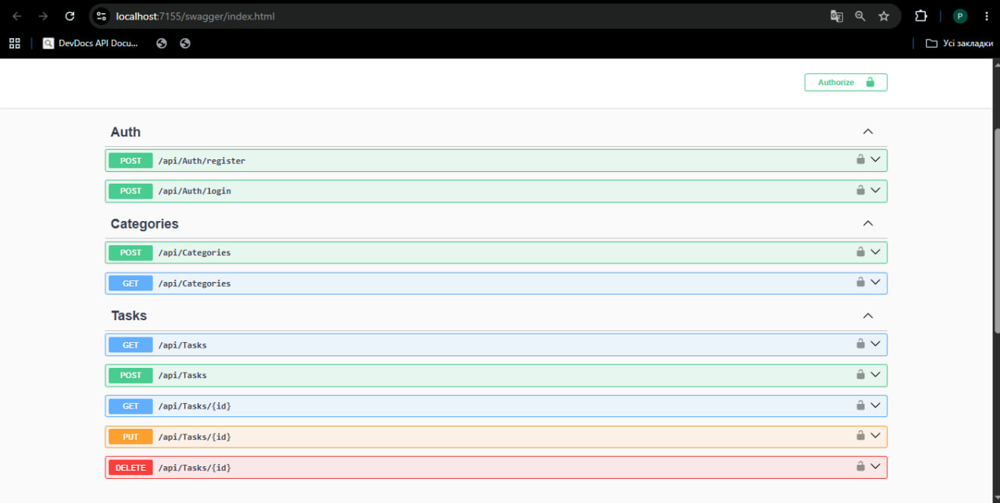

# TaskFlow

Fullstack task management application built with ASP.NET Core Web API, Angular, PostgreSQL, JWT Authentication, and Docker.

## Overview

TaskFlow is a portfolio-oriented fullstack web application focused on task management and user-based data isolation. The project was developed as a practical learning project for backend and frontend development using modern .NET and Angular technologies.

The application supports:

* JWT Authentication and Authorization
* User registration and login
* Role-based authorization (Admin/User)
* Task CRUD operations
* Categories
* Search and filtering
* Pagination
* Error handling middleware
* Angular frontend with Angular Material
* PostgreSQL database
* Dockerized database environment

---

# Tech Stack

## Backend

* ASP.NET Core Web API
* Entity Framework Core
* PostgreSQL
* JWT Authentication
* Docker
* Repository Pattern
* Service Layer
* DTO Pattern
* Middleware-based error handling

## Frontend

* Angular
* Angular Material
* TypeScript
* RxJS
* Reactive Forms
* Route Guards
* HTTP Interceptors

---

# Features

## Authentication

* User registration
* User login
* JWT token generation
* Protected endpoints
* Route guards
* Automatic authorization headers using HTTP interceptors

## Tasks

* Create tasks
* Update tasks
* Delete tasks
* User-specific tasks
* Search tasks
* Filter completed tasks
* Pagination
* Category assignment

## Categories

* Create categories
* Assign categories to tasks
* Admin-only category management

## Error Handling

* Global exception middleware
* Snackbar notifications
* Loading states
* HTTP error interception

---

# Architecture

The backend follows a layered architecture:

```text
Controllers
↓
Services
↓
Repositories
↓
Entity Framework Core
↓
PostgreSQL
```

Patterns used:

* Repository Pattern
* Service Layer Pattern
* DTO Mapping
* Dependency Injection
* Separation of Concerns

---

# Database

Database: PostgreSQL

Main entities:

* Users
* Tasks
* Categories

Relationships:

* One User -> Many Tasks
* One Category -> Many Tasks

---

# Frontend Structure

Frontend is organized using standalone Angular components and feature-based structure.

Main frontend features:

* Angular routing
* Standalone components
* Route guards
* HTTP interceptors
* Reactive forms
* Angular Material UI
* State updates through RxJS observables

---

# API Endpoints

## Authentication

```http
POST /api/auth/register
POST /api/auth/login
```

## Tasks

```http
GET /api/tasks
GET /api/tasks/{id}
POST /api/tasks
PUT /api/tasks/{id}
DELETE /api/tasks/{id}
```

## Categories

```http
GET /api/categories
POST /api/categories
```

---

# Local Setup

## Backend

### Requirements

* .NET 8 SDK
* PostgreSQL
* Docker Desktop

### Run PostgreSQL container

```bash
docker run --name taskflow-postgres \
-e POSTGRES_PASSWORD=postgres \
-e POSTGRES_USER=postgres \
-e POSTGRES_DB=taskflow_db \
-p 5432:5432 \
-d postgres
```

### Run migrations

```bash
update-database
```

### Run backend

```bash
dotnet run
```

Backend Swagger URL:

```text
https://localhost:7155/swagger
```

---

## Frontend

### Requirements

* Node.js
* Angular CLI

### Install dependencies

```bash
npm install
```

### Run Angular application

```bash
ng serve
```

Frontend URL:

```text
http://localhost:4200
```

---

# Screenshots











---

# Current Limitations

This project is still under active development and some production-level features are not fully implemented yet.

Current limitations include:

* Admin role assignment is currently performed manually through the database
* Category management is currently available only through Swagger/API
* Full role management UI is not implemented yet
* Some validation and UX improvements are still pending
* Error handling can still be improved further
* Task editing and filtering functionality can be expanded
* Frontend responsiveness and UI polish are still in progress

---

# Future Improvements

Potential future improvements and planned features:

* Advanced form validation with real-time user feedback
* Better UX/UI for authentication forms
* Password strength and validation indicators
* Improved error handling and user notifications
* Better task editing experience
* Due date editing improvements
* Advanced task filtering and sorting
* Responsive mobile-friendly design
* Real-time updates
* Refresh token authentication
* Role management UI
* User profile management
* Dashboard and analytics
* Server-side pagination
* Performance optimizations
* Unit and integration testing
* CI/CD pipeline setup
* Production-grade logging and monitoring

---

# Deployment

Planned deployment stack:

* Backend: Render
* Frontend: Netlify
* Database: Neon PostgreSQL

---

# Learning Goals

This project was created to practice:

* ASP.NET Core backend development
* REST API design
* Angular frontend development
* Authentication and Authorization
* Entity Framework Core
* PostgreSQL integration
* Docker basics
* Fullstack application architecture
* Git and GitHub workflow
* Deployment fundamentals

---

# Author

GitHub:

https://github.com/PavloYend
